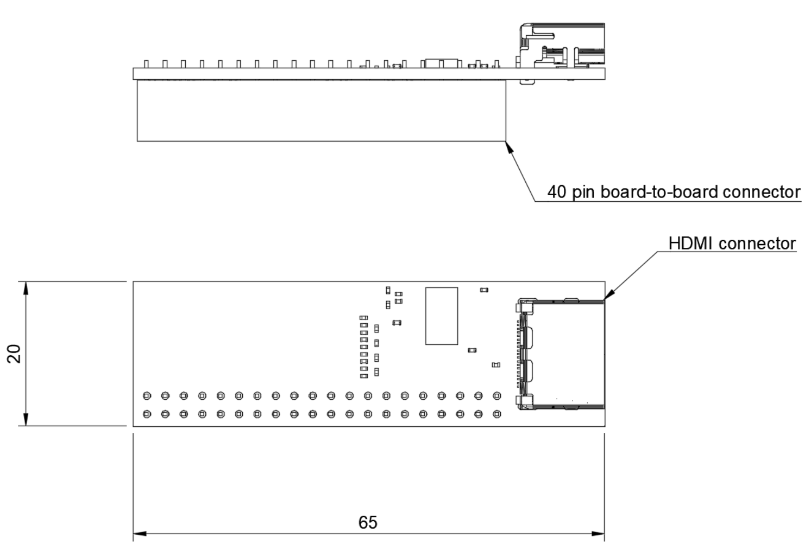

====================
Icicle HDMI breakout
====================

Copyright (c) 2020 `Antmicro <https://www.antmicro.com>`_

.. figure:: img/icicle-hdmi-breakout.png

Overview
========

This repository contains open hardware design files for Antmicro's expansion board compatible with the `PolarFire SoC FPGA Icicle Evaluation Kit from Microchip. <https://www.microsemi.com/existing-parts/parts/152514>`_.
The design files were created in KiCad.
The expansion board breaks out an HDMI interface on a regular HDMI connector.
The TMDS data going out of this connector are connected to the FPGA fabric in `MPFS250T-FCVG484EES <https://www.microsemi.com/document-portal/doc_download/1244583-polarfire-soc-advance-datasheet>`_ PolarFire SoC.
The expansion board should be connected to the ``J26`` expansion connector on the Icicle board.
For more information regarding the electrical connections please refer to the schematic sheets and compare them against the `offcial documentation <https://www.microsemi.com/product-directory/soc-fpgas/5498-polarfire-soc-fpga#resources>`_ of the PolarFire Icicle kit.

Repository structure
--------------------

The main repository directory contains KiCad PCB project files, LICENSE and README.
The remaining files are stored in the following directories:

* ``3d-model`` - contains a `mechanical model <3d-model/icicle-hdmi-breakout.stl>`_ of the board in the stl mesh format
* ``lib`` - contains the component libraries
* ``doc`` - contains selected files for device fabrication (schematic in PDF, BoM)
* ``img`` - contains graphics for this README

Dimensions and layout
=====================

The image below presents the HDMI expansion board's dimensions and layout.

License
=======

`MIT <LICENSE>`_
