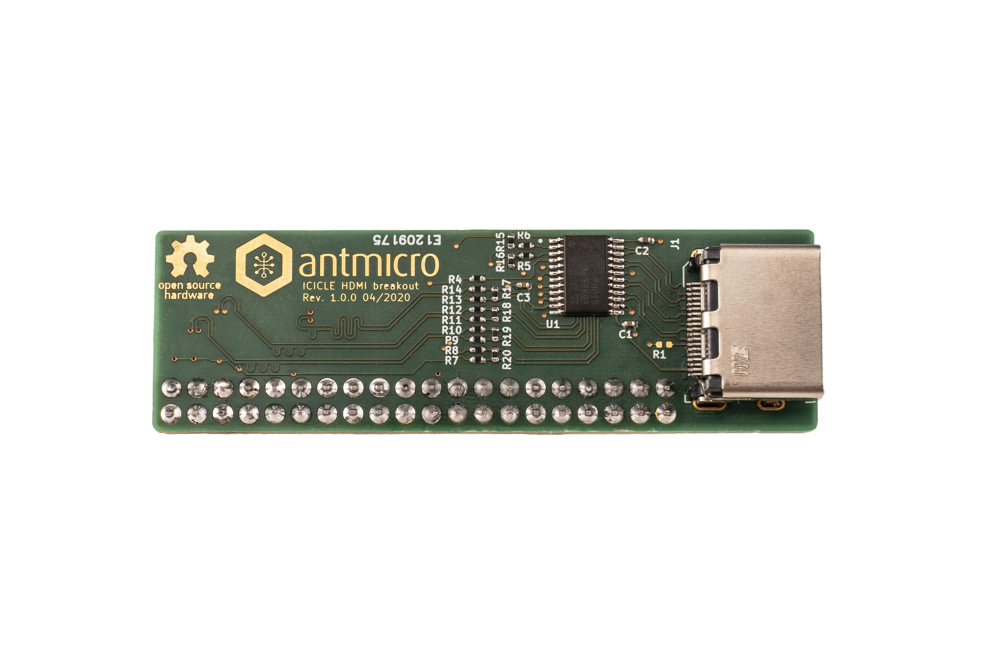

====================
Icicle HDMI breakout
====================

Copyright (c) 2020 `Antmicro <https://www.antmicro.com>`_

Overview
========

This repository contains open hardware design files for expansion board compatible with Microchip `PolarFire SoC FPGA Icicle Evaluation Kit <https://www.microsemi.com/existing-parts/parts/152514>`_.
The design files were created in KiCad.
The expansion board breaks out HDMI interface on a regular HDMI connector.
The TMDS data lanes from this connector are connected to FPGA fabric in `MPFS250T-FCVG484EES <https://www.microsemi.com/document-portal/doc_download/1244583-polarfire-soc-advance-datasheet>`_ PolarFire SoC.
The expansion board should be connected to the ``J26`` expansion connector available on the Icicle board.
For more information regarding electrical connections please refer to the schematic sheets and compare them against the `offcial documentation <://www.microsemi.com/product-directory/soc-fpgas/5498-polarfire-soc-fpga#resources>`_ of PolarFire Icicle kit.

Repository structure
--------------------

The main repository directory contains KiCad PCB project files, a LICENSE and README.
The remaining files are stored in the following directories:

* ``3d-model`` - contains a `mechanical model <3d-model/icicle-hdmi-breakout.stl>`_ of the board in stl mesh format
* ``lib`` - contains the component libraries
* ``doc`` - contains selected files for device fabrication (schematic in PDF, BoM)
* ``img`` - contains graphics for this README

License
=======

`MIT <LICENSE>`_
